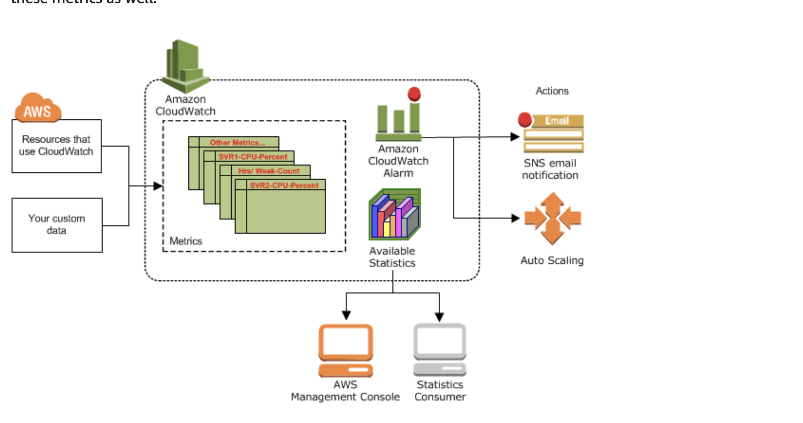

# Cloudwatch
* Cloudwatch is metrics repository. With such repository you can get statistics.
* You can use metrics to calculate statistics and then present the data graphically in the CloudWatch console.
* Metrics are stored separately in Regions but you can use CloudWatch cross-Region functionality to aggregate statistics from different Region
* You can provide your own custom metrics to cloudwatch.
* You can create **alarms** based on statistics which initiate (when outside of threshold):
  - EC2 ASG
  - Amazon SNS

* Concepts in CW:
   - Namespaces
   - Metrics - fundametnal concept in CW. **Time-ordered set of data point** published to CW. Metrics exists only in region where they were created. Metrics **cannot be deleted** but they expire after **15** months if given **metric** is not updated.
   - Dimensions
   - Statistics
   - Percentiles
   - Alarms

**Billing alarms** - Before you can create an alarm for your estimated charges, you must enable billing alerts, so that you can monitor your estimated AWS charges and create an alarm using billing metric data. After you enable billing alerts, you cannot disable data collection, but you can delete any billing alarms that you created (enable billing alarms in account preferences)

TODO:
* When use CW + AWS SNS
* When use Cw + AWS SES

Cloudwatch - metrics with high resolution.

