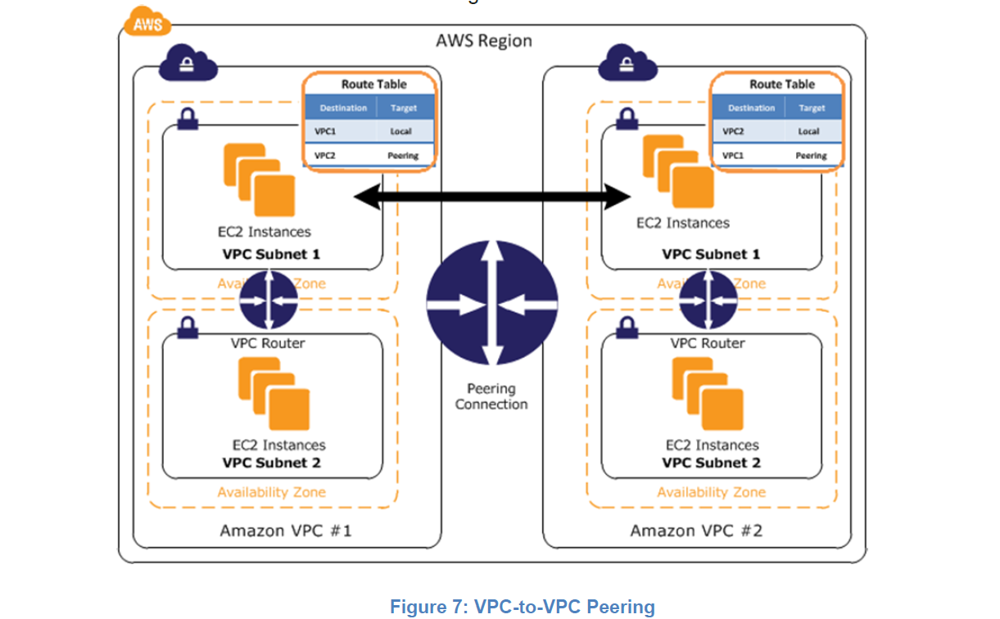
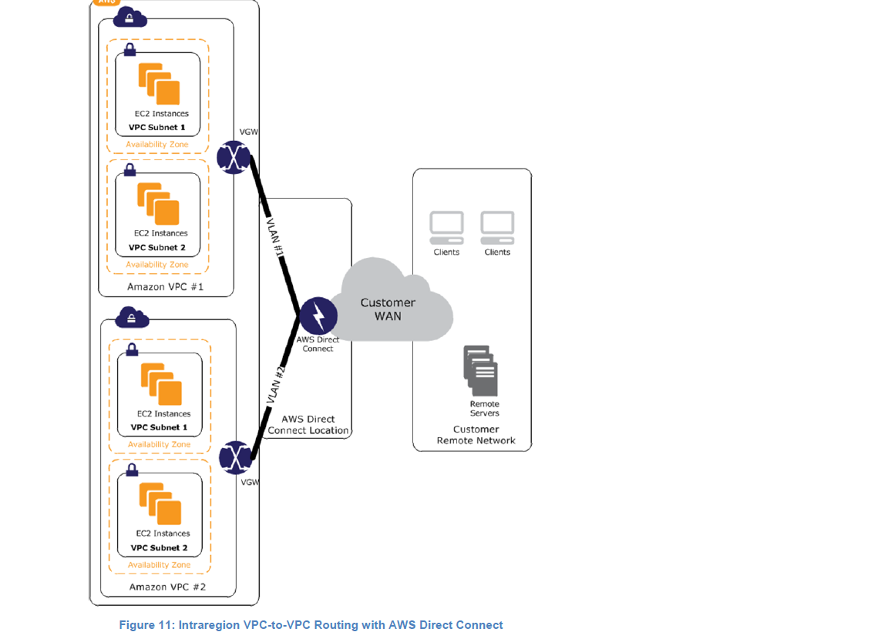
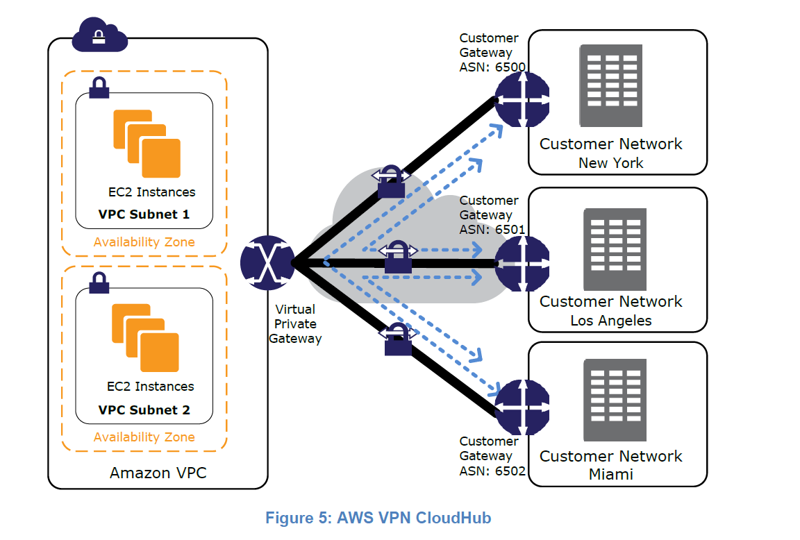
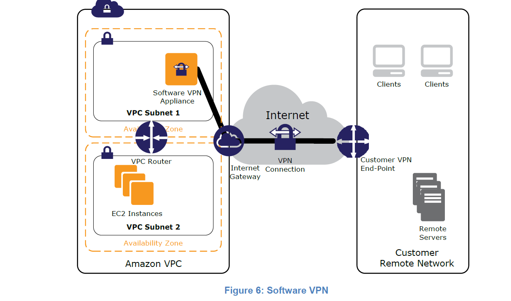
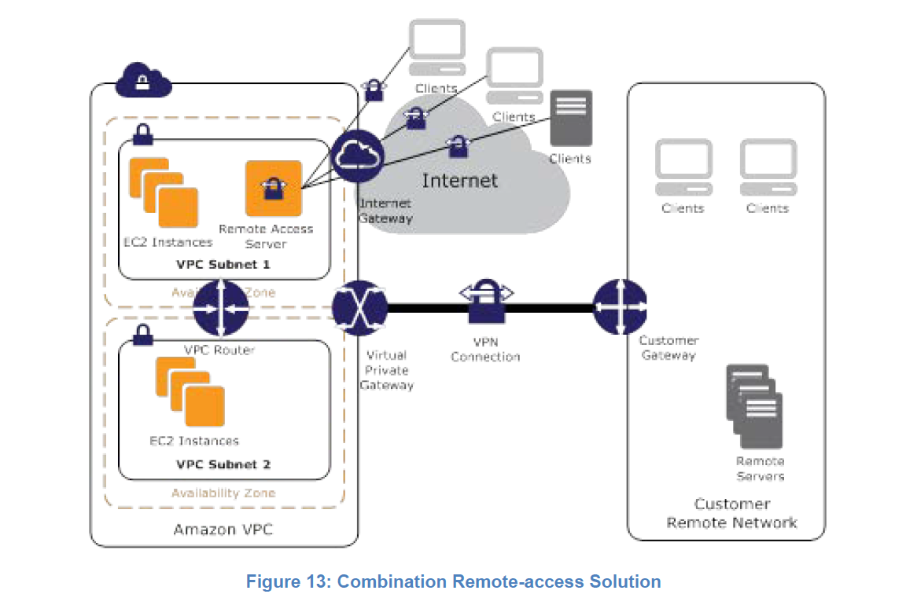

#### VPC connectivity options

1. VPC to VPC
  * __VPC peering__
    * Components: __peering connection__

  _Recommended solution. CIDRs cannot overlap. Can be done between VPCs in same or different account. Supports routing between private IPs. Can be done in the same of different AWS regions(to verify)_
  
  * __Hardware VPN__
    * Components: __virtual gw__ -> __virtual gw__

  _Recommended approach when you want to take advantage of AWS-managed VPN endpoints including the automated multidata center redundancy and failover built into the AWS side of each VPN connection. Although not shown, the Amazon VGW represents two distinct VPN endpoints, physically located in separate data centers to increase the availability of each VPN connection._
  
  * Software VPN
  * Software to Hardware VPN
  * __AWS Direct Connect__
    * Components: __virtual gw__ -> __aws direct connect location__

  _This option can potentially reduce network costs, increase bandwidth throughput, and provide a more consistent network experience than the other VPC-to-VPC connectivity options. You can divide a physical AWS Direct Connect connection into multiple logical connections, one for each VPC._
  
2. VPC to datacenter
  * __Hardware VPN__
    * Components: __virtual gw (support failover)__ & __customer gw__

  _Consider taking this approach when you want to take advantage of an AWS-managed VPN endpoint that includes automated multi–data center redundancy and failover built into the AWS side of the VPN connection. Although not shown, the Amazon virtual private gateway (VGW) represents two distinct VPN endpoints, physically located in separate data centers to increase the availability of your VPN connection_.
  
  * __AWS Direct connect__
    * Components: __virtual gw__ -> __aws direct connect location__

  _Dedicated network connection over private lines_
  
  * __AWS Direct connect + VPN__ _With AWS Direct Connect + VPN, you can combine one or more AWS Direct Connect dedicated network connections with the Amazon VPC hardware VPN. This combination provides an IPsec-encrypted private connection that also reduces network costs, increases bandwidth throughput, and provides a more consistent network experience than Internet-based VPN connections._
  
  * __AWS Cloud Hub__
    * Components: __virtual gw__ -> __customer gw(s)__

  _Use when trying to connect multiple remote office branches. Reuse existing internet connections between branches_
  
  * __Software VPN__ _This option is useful when you need to manage both side of connections due to compliance reasons or leveraging gateway devices not supported by AWS_
  
3. VPN clients connecting to VPC
  * __Software Remote access VPN__
    * Components: __internet gw__ -> __client app__

    _Using existing VPN technologies to connect to AWS VPC(s)_
  
  * __User network to AWS VPC options__
    * Components: __client app__ -> __virtual gw__ -> __customer gw__

  _Virtual extension of existing VPN connection to User network_
  

  __When using Software VPN customer is responsible for: upgrades, patches, maintenance, user management, configuration__
